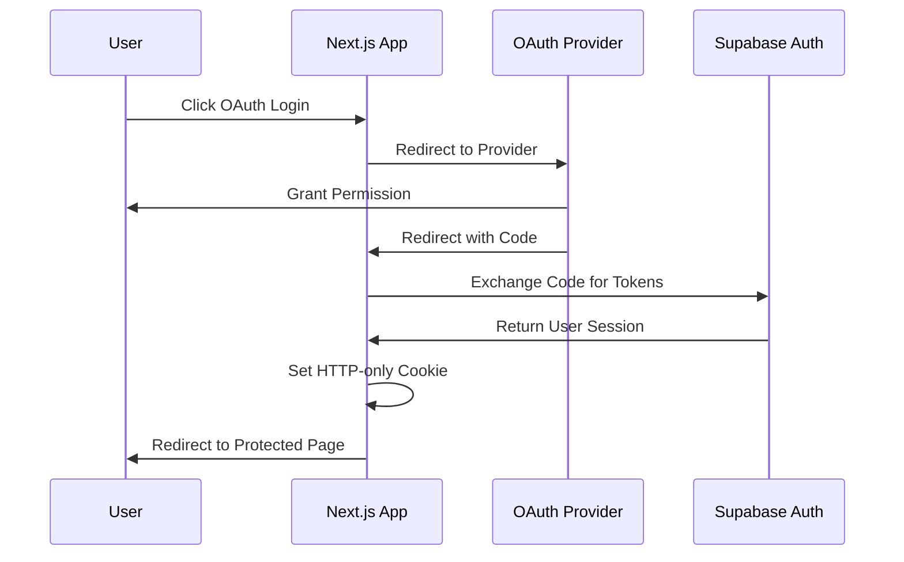

# Project Burger Shop Advanced Auth - 6

🍔 **OAuth & JWT API Authentication** - Advanced authentication with Google/GitHub OAuth and JWT-protected APIs

This project demonstrates **advanced authentication patterns** with Supabase Auth, featuring OAuth providers (Google & GitHub), server-side session management, middleware protection, and JWT-protected API routes, showcasing enterprise-ready authentication architectures.

## 🚀 Features

### Supabase Advanced Auth Integration
This project showcases the following **Supabase features**:

- **🔗 OAuth Providers**: Google and GitHub authentication integration
- **🍪 Session Management**: Server-side cookie-based sessions
- **🛡️ Middleware Protection**: Route-level authentication guards
- **🔑 JWT Verification**: Token-protected API endpoints
- **⚡ Server-Side Auth**: Next.js App Router integration
- **🔄 Token Exchange**: OAuth code to session cookie flow
- **🎯 Role-Based Access**: User claims and permissions

### Application Features
- **🌐 Social Login**: Sign in with Google or GitHub accounts
- **🔐 Secure Sessions**: HTTP-only cookie session management
- **🚪 Protected Routes**: Middleware-based access control
- **🔎 Token Inspection**: View and test JWT claims
- **📡 API Security**: JWT-protected endpoint demonstrations
- **📱 Responsive Design**: Modern mobile-friendly interface

## 🛠️ Setup

### 1. Environment Configuration

Copy environment file and configure variables:

```bash
cp .env.example .env.local
```

Set the following variables:

```bash
# Supabase Configuration
NEXT_PUBLIC_SUPABASE_URL=https://your-project-ref.supabase.co
NEXT_PUBLIC_SUPABASE_ANON_KEY=your-anon-key

# JWT Secret (Server-Only)
SUPABASE_JWT_SECRET=your-jwt-secret
```

**Where to find JWT Secret:**
- Go to **Supabase Dashboard** → **Settings** → **API**
- Copy the **JWT Secret** value

### 2. OAuth Provider Configuration

In **Supabase Dashboard** → **Authentication** → **Providers**:

#### Google OAuth
1. Enable Google provider
2. Set **Client ID** and **Client Secret** from Google Cloud Console
3. Configure **Redirect URL**: `http://localhost:3000/auth/callback`

#### GitHub OAuth
1. Enable GitHub provider
2. Set **Client ID** and **Client Secret** from GitHub OAuth Apps
3. Configure **Redirect URL**: `http://localhost:3000/auth/callback`

### 3. Application Setup

```bash
cd apps/project-burger-shop-auth-advanced-6
npm install
npm run dev
```

Open `http://localhost:3000` and test OAuth login with Google or GitHub.

## 🏃‍♂️ Usage

### Authentication Flow

1. **Visit `/auth/login`** - Choose OAuth provider (Google/GitHub)
2. **OAuth Redirect** - Redirect to provider for authentication
3. **Callback Handling** - Server exchanges code for session cookie
4. **Access Protected Routes** - Navigate to protected pages
5. **API Testing** - Test JWT-protected endpoints

### Key Pages

- **`/`** - Landing page with navigation
- **`/auth/login`** - OAuth provider selection and login
- **`/auth/callback`** - OAuth callback handler (server-side)
- **`/protected`** - Protected page requiring authentication
- **`/api/jwt-echo`** - JWT-protected API endpoint

## 📁 Project Structure

### Core Application Files
- **`app/auth/login/page.tsx`** - OAuth login interface
- **`app/auth/callback/route.ts`** - OAuth callback handler
- **`app/protected/page.tsx`** - Protected server-rendered page
- **`app/middleware.ts`** - Route protection middleware
- **`app/api/jwt-echo/route.ts`** - JWT verification API

### Configuration Files
- **`.env.local`** - Environment variables
- **`middleware.ts`** - Authentication middleware

## 🎯 Technical Implementation

### OAuth Flow Architecture



### JWT Token Verification

The protected API demonstrates **JWT verification** using the Supabase JWT secret:

```typescript
// /api/jwt-echo/route.ts
import jwt from 'jsonwebtoken';

const token = authHeader?.replace('Bearer ', '');
const decoded = jwt.verify(token, process.env.SUPABASE_JWT_SECRET!);

return Response.json({
  sub: decoded.sub,      // User ID
  role: decoded.role,    // User role
  exp: decoded.exp,      // Expiration time
  aud: decoded.aud       // Audience
});
```

### Middleware Protection

**`middleware.ts`** provides **route-level security**:

```typescript
export function middleware(request: NextRequest) {
  // Check for valid session cookie
  const session = await getSession(request);

  if (!session && request.nextUrl.pathname.startsWith('/protected')) {
    return NextResponse.redirect(new URL('/auth/login', request.url));
  }

  return NextResponse.next();
}
```

### Session Management

- **HTTP-only Cookies**: Secure session storage
- **Server-side Validation**: Session verification on protected routes
- **Automatic Refresh**: Token refresh handled by Supabase client
- **Cross-site Security**: CSRF protection built-in

## 🔒 Security Features

### Authentication Security
- **OAuth 2.0**: Industry-standard authentication flow
- **PKCE Support**: Proof Key for Code Exchange (when supported)
- **State Verification**: CSRF protection during OAuth flow
- **Secure Cookies**: HTTP-only, SameSite, Secure flags

### API Security
- **JWT Verification**: Cryptographic token validation
- **Secret Protection**: Server-only JWT secret storage
- **Token Expiration**: Automatic session timeout
- **Claims Validation**: Role and permission checking

### Best Practices
- **Never expose JWT secret** to client-side code
- **Use secure cookies** for session management
- **Implement proper logout** and session invalidation
- **Validate all tokens** before granting access

## ⚠️ Troubleshooting

### Common Issues

**OAuth Redirect Fails**
- **Check**: Redirect URL matches exactly in Supabase Dashboard
- **Verify**: OAuth provider configuration (Client ID/Secret)
- **Ensure**: HTTP/HTTPS protocol matches

**"Invalid JWT" Error**
- **Cause**: JWT secret mismatch or token expired
- **Solution**: Verify `SUPABASE_JWT_SECRET` matches Dashboard value
- **Check**: Token hasn't expired (default 1 hour)

**Middleware Blocking Access**
- **Check**: Session cookie exists and is valid
- **Verify**: Cookie domain and path settings
- **Test**: Session by visiting `/auth/login` first

**API Returns 401 Unauthorized**
- **Check**: Authorization header format: `Bearer <token>`
- **Verify**: Token is valid and not expired
- **Test**: Token at `/auth/login` page first

### Debug Mode

Enable detailed logging by setting:
```bash
# In .env.local
DEBUG=supabase:auth
NODE_ENV=development
```

## 🧪 Testing JWT API

Test the protected API endpoint:

```bash
# First, get your access token from /auth/login page
# Then test the API:

curl -X GET http://localhost:3000/api/jwt-echo \
  -H "Authorization: Bearer YOUR_ACCESS_TOKEN" \
  -H "Content-Type: application/json"
```

Expected response:
```json
{
  "sub": "user-uuid",
  "role": "authenticated",
  "exp": 1640995200,
  "aud": "authenticated"
}
```

## 📚 Further Learning

- [Supabase Auth Documentation](https://supabase.com/docs/guides/auth)
- [OAuth 2.0 Guide](https://oauth.net/2/)
- [Next.js Middleware](https://nextjs.org/docs/advanced-features/middleware)
- [JWT Handbook](https://jwt.io/introduction/)

## 🔧 Production Considerations

### Environment Variables
- **JWT Secret**: Store securely in production environment
- **OAuth Secrets**: Rotate provider secrets periodically
- **Redirect URLs**: Update for production domains

### Security Enhancements
- **Rate Limiting**: Implement on authentication endpoints
- **Session Management**: Configure appropriate timeouts
- **Error Handling**: Avoid leaking sensitive information
- **Logging**: Monitor authentication attempts and failures

---

**🎉 Advanced Authentication Demo - showcasing enterprise-ready OAuth and JWT patterns!**

