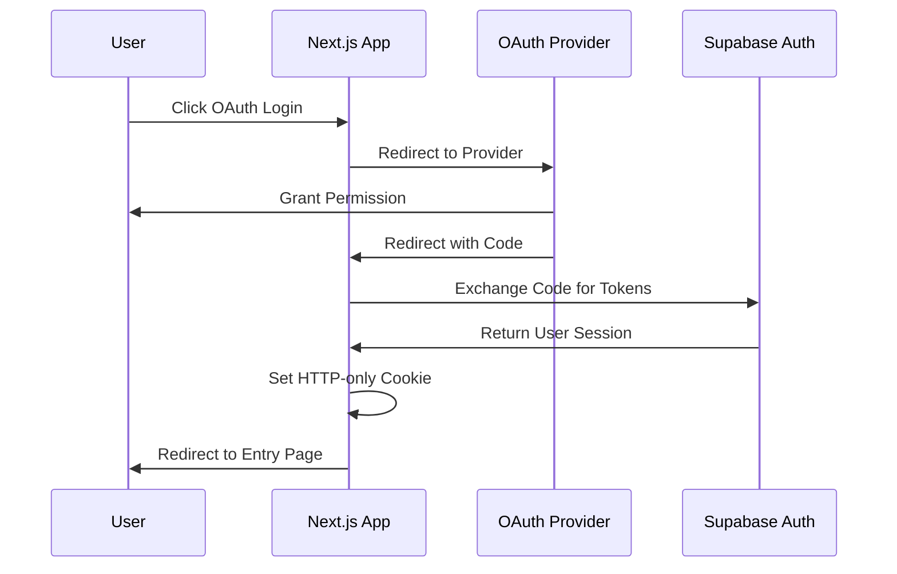

# Project Burger Shop Advanced Auth (Clerk) - 7

🍔 **OAuth & JWT API Authentication** - Advanced authentication with Google/GitHub OAuth, native email/password with required profile fields, optional Clerk login, and JWT-protected APIs

This project demonstrates **advanced authentication patterns** with Supabase Auth, featuring OAuth providers (Google & GitHub), server-side session management, middleware protection, and JWT-protected API routes, showcasing enterprise-ready authentication architectures.

## 🚀 Features

### Supabase Advanced Auth Integration
This project showcases the following **Supabase features**:

- **🔗 OAuth Providers**: Google and GitHub authentication integration
- **📧 Email/Password**: Built-in email sign-in/sign-up; sign-up requires `name` and `optional_info` (both required)
- **🍪 Session Management**: Server-side cookie-based sessions
- **🛡️ Middleware Protection**: Route-level authentication guards
- **🔑 JWT Verification**: Token-protected API endpoints
- **⚡ Server-Side Auth**: Next.js App Router integration
- **🔄 Token Exchange**: OAuth code to session cookie flow
- **🎯 Role-Based Access**: User claims and permissions

### Application Features
- **🌐 Social Login**: Sign in with Google or GitHub accounts
- **🔐 Secure Sessions**: HTTP-only cookie session management
- **🚪 Entry Route**: Middleware-ready access control
- **🔎 Token Inspection**: View and test JWT claims
- **📡 API Security**: JWT-protected endpoint demonstrations
- **📱 Responsive Design**: Modern mobile-friendly interface

## 🛠️ Setup

### 1. Environment Configuration

Copy environment file and configure variables:

```bash
cp .env.example .env.local
```

Set the following variables:

```bash
# Supabase Configuration
NEXT_PUBLIC_SUPABASE_URL=https://your-project-ref.supabase.co
NEXT_PUBLIC_SUPABASE_ANON_KEY=your-anon-key

# JWT Secret (Server-Only)
SUPABASE_JWT_SECRET=your-jwt-secret

# Clerk (optional, for /clerk/login)
# You can set the publishable key via the UI Settings (⚙️) on /clerk/login or directly here.
NEXT_PUBLIC_CLERK_PUBLISHABLE_KEY=pk_test_xxx
CLERK_SECRET_KEY=sk_test_xxx
```

**Where to find JWT Secret:**
- Go to **Supabase Dashboard** → **Settings** → **API**
- Copy the **JWT Secret** value

### 2. OAuth Provider Configuration

In **Supabase Dashboard** → **Authentication** → **Providers**:

#### Google OAuth
1. Enable Google provider
2. Set **Client ID** and **Client Secret** from Google Cloud Console
3. Configure **Redirect URL**: `http://localhost:3000/auth/callback`

#### GitHub OAuth
1. Enable GitHub provider
2. Set **Client ID** and **Client Secret** from GitHub OAuth Apps
3. Configure **Redirect URL**: `http://localhost:3000/auth/callback`

### 3. Application Setup

```bash
cd apps/project-burger-shop-auth-advanced-clerk-7
npm install
npm run dev
```

Open `http://localhost:3000` and test:
- `/clerk/login` OAuth (Google/GitHub) and native email sign-in/sign-up
- `/clerk/login` Clerk sign-in (requires Clerk env vars)
  - If no publishable key is configured, the Clerk pages show a non-blocking status card instead of throwing.
  - You can paste the key directly on the Clerk page or set it via the Settings (⚙️) on `/clerk/login`.

### 4. Database Init (Profiles)

Sign-up requires two profile fields, `name` and `optional_info`, stored in the `public.profiles` table.

Run `scripts/init.sql` in the Supabase SQL Editor.

This script will:
- Create `public.profiles(user_id uuid primary key, name text not null, optional_info text not null, ...)`
- Enable RLS and add policies so users can only access their own profile row
- Add a trigger on `auth.users` to auto-insert a `profiles` row from `raw_user_meta_data` when a new user is created

## 🏃‍♂️ Usage

### Authentication Flow

1. **Visit `/clerk/login`** - Choose OAuth provider (Google/GitHub)
2. **OAuth Redirect** - Redirect to provider for authentication
3. **Callback Handling** - Server exchanges code for session cookie
4. **Access Entry Page** - Navigate to entry page
5. **API Testing** - Test JWT-protected endpoints

### Key Pages

- **`/`** - Landing page with navigation
- **`/clerk/login`** - OAuth (Google/GitHub/Apple) + native email sign-in/sign-up (requires `name` and `optional_info` on sign-up)
- **`/auth/callback`** - OAuth callback handler (server-side)
- **`/entry`** - Entry page shown after sign-in (shows: “Welcome, your name is ...”)
  - If server env is missing, the page uses a client-side fallback that reads the session via the browser client (based on Settings ⚙️), so you can still see your greeting without .env.
- **`/api/jwt-echo`** - JWT-protected API endpoint
- **`/clerk/login`** - Clerk sign-in page (optional)
  - Uses a catch-all route `app/clerk/login/[[...sign-in]]/page.tsx` so Clerk internal paths like `/clerk/login/sso-callback` resolve correctly.

## 📁 Project Structure

### Core Application Files
- **`app/clerk/login/page.tsx`** - OAuth login interface
- **`app/entry/page.tsx`** - Entry server-rendered page

### Configuration Files
- **`.env.local`** - Environment variables

## 🎯 Technical Implementation

### OAuth Flow Architecture



### JWT Token Verification

The protected API demonstrates **JWT verification** using the Supabase JWT secret:

```typescript
// /api/jwt-echo/route.ts
import jwt from 'jsonwebtoken';

const token = authHeader?.replace('Bearer ', '');
const decoded = jwt.verify(token, process.env.SUPABASE_JWT_SECRET!);

return Response.json({
  sub: decoded.sub,      // User ID
  role: decoded.role,    // User role
  exp: decoded.exp,      // Expiration time
  aud: decoded.aud       // Audience
});
```

### Middleware Protection


```typescript
export function middleware(request: NextRequest) {
  // Check for valid session cookie
  const session = await getSession(request);

  if (!session && request.nextUrl.pathname.startsWith('/entry')) {
    return NextResponse.redirect(new URL('/clerk/login', request.url));
  }

  return NextResponse.next();
}
```

### Session Management

- **HTTP-only Cookies**: Secure session storage
- **Server-side Validation**: Session verification on protected routes
- **Automatic Refresh**: Token refresh handled by Supabase client
- **Cross-site Security**: CSRF protection built-in

## 🔒 Security Features

### Authentication Security
- **OAuth 2.0**: Industry-standard authentication flow
- **PKCE Support**: Proof Key for Code Exchange (when supported)
- **State Verification**: CSRF protection during OAuth flow
- **Secure Cookies**: HTTP-only, SameSite, Secure flags

### API Security
- **JWT Verification**: Cryptographic token validation
- **Secret Protection**: Server-only JWT secret storage
- **Token Expiration**: Automatic session timeout
- **Claims Validation**: Role and permission checking

### Best Practices
- **Never expose JWT secret** to client-side code
- **Use secure cookies** for session management
- **Implement proper logout** and session invalidation
- **Validate all tokens** before granting access

## ⚠️ Troubleshooting

### Common Issues

**OAuth Redirect Fails**
- **Check**: Redirect URL matches exactly in Supabase Dashboard
- **Verify**: OAuth provider configuration (Client ID/Secret)
- **Ensure**: HTTP/HTTPS protocol matches

**"Invalid JWT" Error**
- **Cause**: JWT secret mismatch or token expired
- **Solution**: Verify `SUPABASE_JWT_SECRET` matches Dashboard value
- **Check**: Token hasn't expired (default 1 hour)

**Middleware Blocking Access**
- **Check**: Session cookie exists and is valid
- **Verify**: Cookie domain and path settings
- **Test**: Session by visiting `/clerk/login` first

**API Returns 401 Unauthorized**
- **Check**: Authorization header format: `Bearer <token>`
- **Verify**: Token is valid and not expired
- **Test**: Token at `/clerk/login` page first

### Debug Mode

Enable detailed logging by setting:
```bash
# In .env.local
DEBUG=supabase:auth
NODE_ENV=development
```

## 🧪 Testing JWT API

Test the protected API endpoint:

```bash
# First, get your access token from /clerk/login page
# Then test the API:

curl -X GET http://localhost:3000/api/jwt-echo \
  -H "Authorization: Bearer YOUR_ACCESS_TOKEN" \
  -H "Content-Type: application/json"
```

Expected response:
```json
{
  "sub": "user-uuid",
  "role": "authenticated",
  "exp": 1640995200,
  "aud": "authenticated"
}
```

## 📚 Further Learning

- [Supabase Auth Documentation](https://supabase.com/docs/guides/auth)
- [OAuth 2.0 Guide](https://oauth.net/2/)
- [Next.js Middleware](https://nextjs.org/docs/advanced-features/middleware)
- [JWT Handbook](https://jwt.io/introduction/)

## 🔧 Production Considerations

### Environment Variables
- **JWT Secret**: Store securely in production environment
- **OAuth Secrets**: Rotate provider secrets periodically
- **Redirect URLs**: Update for production domains

### Security Enhancements
- **Rate Limiting**: Implement on authentication endpoints
- **Session Management**: Configure appropriate timeouts
- **Error Handling**: Avoid leaking sensitive information
- **Logging**: Monitor authentication attempts and failures

---

**🎉 Advanced Authentication Demo - showcasing enterprise-ready OAuth and JWT patterns!**

## Clerk + Supabase (Quick Guide)

This section explains, in plain English, how to integrate Clerk with Supabase following the spirit of the official docs.

1) What is a JWT? Think of it as a signed “ID card”
- Clerk issues a signed JSON Web Token (JWT) after a successful sign‑in.
- It contains key info, most importantly the user’s unique ID (sub = subject).
- Anyone can read the token, but only the holder of the correct public key can verify its signature.

2) How Clerk and Supabase work together
- Your frontend signs in with Clerk and receives a JWT.
- Every request to Supabase includes that JWT (the “ID card”).
- Supabase verifies the JWT using Clerk’s JWKS; if valid, the request proceeds and Supabase knows who you are (from sub). RLS then decides what you’re allowed to do.

3) Read the “ID card” in RLS with auth.jwt()
- With Supabase Auth you often used auth.uid() in RLS.
- With Clerk, use auth.jwt() to read fields from the external JWT, e.g. (auth.jwt() ->> 'sub') for the Clerk user ID.

4) RLS side‑by‑side
- Supabase Auth style:
```sql
-- Only allow users to view their own profile
create policy "Users can view their own profile." on profiles
for select using (auth.uid() = id);
```
- Clerk + Supabase style:
```sql
-- Only allow users to view their own profile (id or clerk_user_id stores Clerk's sub)
create policy "Users can view their own profile." on profiles
for select using ((auth.jwt() ->> 'sub') = id);
```
- Practical tip: add a dedicated column clerk_user_id and use
  (clerk_user_id = (auth.jwt() ->> 'sub')) to avoid mixing concerns with existing columns.

5) Required config and syncing
- Data sync: ensure a column (e.g., clerk_user_id) stores Clerk’s sub; write it via webhook/backend or first‑time upsert.
- Trust Clerk in Supabase: enable Third‑Party Auth: Clerk (or set it in config.toml for self‑hosting) and complete JWKS configuration.
- Update RLS: migrate auth.uid()‑based policies to auth.jwt() (or keep both with an OR policy during transition).

6) Frontend code patterns (two equivalent ways)
- Callback style (recommended):
```ts
import { createClient } from '@supabase/supabase-js';
import { useSession } from '@clerk/nextjs';

const { session } = useSession();
const supabase = createClient(
  process.env.NEXT_PUBLIC_SUPABASE_URL!,
  process.env.NEXT_PUBLIC_SUPABASE_PUBLISHABLE_KEY!,
  { accessToken: async () => (await session?.getToken()) ?? null }
);
```
- Set‑once style (mirrors the official snippet):
```ts
import { createClient } from '@supabase/supabase-js';
import { useAuth } from '@clerk/nextjs';

const { getToken } = useAuth();
const supabase = createClient(
  process.env.NEXT_PUBLIC_SUPABASE_URL!,
  process.env.NEXT_PUBLIC_SUPABASE_PUBLISHABLE_KEY!
);

async function fetchData() {
  const token = await getToken();
  await supabase.auth.setSession({ access_token: token, refresh_token: '' } as any);
  const { data, error } = await supabase.from('your_table').select('*');
}
```
Note: API names can vary across SDK versions; the core idea is “attach the Clerk JWT to every Supabase request”.

7) Bottom line
- Clerk handles authentication (who you are). Supabase RLS handles authorization (what you can do).
- The key change is switching RLS from auth.uid() to (auth.jwt() ->> 'sub') (or using the clerk_user_id + OR policies we provide) when you adopt Clerk.

## 🧩 Implementation Details

This section explains how each part works, which functions are used, and what you must configure. All paths are under `apps/project-burger-shop-auth-advanced-6`.

### 1) Supabase clients (browser/server)
- File: `lib/supabase/client.ts`
  - Function: `createBrowserClient()` uses `@supabase/supabase-js` `createClient(url, anon)` to create a browser client.
  - Behavior: reads `supabase_url` and `supabase_anon_key` from `localStorage` (for quick local switching). If not found, falls back to `.env.local` `NEXT_PUBLIC_SUPABASE_URL` and `NEXT_PUBLIC_SUPABASE_ANON_KEY`.
- File: `lib/supabase/server.ts`

### 2) OAuth sign-in (Google / GitHub)
- File: `app/clerk/login/page.tsx`
  - Uses a preflight flow with `supabase.auth.signInWithOAuth({ provider, options: { redirectTo, skipBrowserRedirect: true } })`.
  - If no error, manually redirect to `data.url`. If the provider isn’t enabled, shows a friendly guidance message.
  - `redirectTo` must match your provider callback URL (e.g., `http://localhost:3000/auth/callback`).
- Uses `routeHandlerClient()` + `supabase.auth.exchangeCodeForSession(code)` to exchange the code for a server session cookie, then redirects to `/entry`.

Config requirement: enable providers and set the callback URL in Supabase Dashboard → Authentication → Providers.

### 3) Native email sign-in/sign-up (required fields)
- File: `app/clerk/login/page.tsx`
  - Sign-in: `supabase.auth.signInWithPassword({ email, password })`
  - Sign-up: `supabase.auth.signUp({ email, password, options: { data: { name, optional_info } } })`
    - UI enforces both `name` and `optional_info` are required during sign-up.
  - Profile persistence: `supabase.from('profiles').upsert({ user_id, name, optional_info }, { onConflict: 'user_id' })` to ensure a row exists for the user.

DB requirement: run `scripts/init.sql` to create `public.profiles`, enable RLS, and add policies so users can access only their own row. The script also adds an `auth.users` trigger to auto-insert from `raw_user_meta_data`.

### 4) Entry page and middleware
- File: `app/entry/page.tsx`
  - Display name: prefers `profiles.name`, then `user.user_metadata.name`, then falls back to `user.email`.
  - Copy: on success shows “Welcome, your name is …”; if not signed in, shows a login prompt.
  - Client fallback: `app/entry/ClientFallback.tsx` reads the session from the browser using `createBrowserClient()` configured via Settings (⚙️).
  - Clerk-token demo: `app/entry/TasksWithClerk.tsx` shows how to read/write data with Clerk JWT → Supabase RLS.
  - Uses `createMiddlewareClient({ req, res })` + `supabase.auth.getUser()`.
  - Example matcher targets `/entry`: `export const config = { matcher: ['/entry'] }`.

### 5) JWT-protected API (verify access token)
  - Reads `Authorization: Bearer <token>`.
  - Verifies with `jsonwebtoken.verify(token, process.env.SUPABASE_JWT_SECRET)`.
  - Returns `sub/exp/aud/role` for debugging.
  - Requires `SUPABASE_JWT_SECRET` in `.env.local` (Dashboard → Settings → API).

### 6) Clerk sign-in page (optional)
- File: `app/ClerkRootProvider.tsx`: global, safe `ClerkProvider` wrapper that reads the publishable key from env or `localStorage`.
- File: `app/clerk/layout.tsx`: does not mount a `ClerkProvider` (to avoid nesting); when no key is present, shows a status card with an inline input or a link to open Settings (⚙️). When a key exists, just renders children.
- File: `app/clerk/login/[[...sign-in]]/page.tsx`: renders `<SignIn routing="path" path="/clerk/login" />` and handles `/clerk/login` and subpaths like `/clerk/login/sso-callback`.
- Navigation: `app/layout.tsx` adds a link to `/clerk/login`.
- Env vars: `NEXT_PUBLIC_CLERK_PUBLISHABLE_KEY` and `CLERK_SECRET_KEY` in `.env.local`.
  - Settings panel: the gear (⚙️) on `/clerk/login` can set `clerk_publishable_key` locally and reload.
  - Clerk page: missing-key card also lets you paste and save the key directly.
- Note: Clerk auth is independent of Supabase in this demo; to protect pages with Clerk, add Clerk middleware/server checks separately.

### 7) Database structure and policies
- File: `scripts/init.sql`
  - Table: `public.profiles(user_id uuid primary key references auth.users(id) on delete cascade, name text not null, optional_info text not null, created_at, updated_at)`
  - Trigger: `profiles_set_updated_at` maintains `updated_at`.
  - RLS: enable and add select/insert/update policies for `auth.uid() = user_id`.
  - Sync trigger: `on_auth_user_created` inserts from `raw_user_meta_data`.
  - Clerk integration: adds `clerk_user_id` column and RLS policies based on `(auth.jwt() ->> 'sub')`.
  - Demo table: `public.tasks` + RLS for Clerk users (used by `TasksWithClerk`).

### 8) Environment variables
- Supabase: `NEXT_PUBLIC_SUPABASE_URL`, `NEXT_PUBLIC_SUPABASE_ANON_KEY`, `SUPABASE_JWT_SECRET`
- Clerk (optional): `NEXT_PUBLIC_CLERK_PUBLISHABLE_KEY`, `CLERK_SECRET_KEY`
- For quick local switching, the `/clerk/login` settings panel (⚙️) can override URL/Anon Key via `localStorage`.

### 9) API/function quick reference
- `createClient(url, anon)` (`@supabase/supabase-js`)
- `signInWithOAuth({ provider, options: { redirectTo } })`
- `signInWithPassword({ email, password })`
- `signUp({ email, password, options: { data } })`
- `auth.exchangeCodeForSession(code)` (`@supabase`)
- `auth.getUser()` (server/middleware/client via the respective client)
- `from('profiles').upsert(row, { onConflict: 'user_id' })`
- `jsonwebtoken.verify(token, SUPABASE_JWT_SECRET)`

### 10) Local testing tips
- OAuth: enable providers and set callback URL → visit `/clerk/login` → choose Google/GitHub.
- Email sign-up: switch to “Sign up” and enter email/password/name/optional_info → visit `/entry` to see the welcome message.
- JWT API: copy the access token from `/clerk/login` → `curl /api/jwt-echo -H "Authorization: Bearer <token>"`.
- Clerk: set Clerk env vars and visit `/clerk/login` (demo shows the sign-in component only).
#### Apple Sign in with Apple
1. Enable Apple provider
2. Configure Services ID and Team settings per Supabase docs
3. Set **Redirect URL**: `http://localhost:3000/auth/callback`
#### Apple Sign in with Apple
1. Enable Apple provider
2. Configure Services ID and Team settings per Supabase docs
3. Set **Redirect URL**: `http://localhost:3000/auth/callback`
