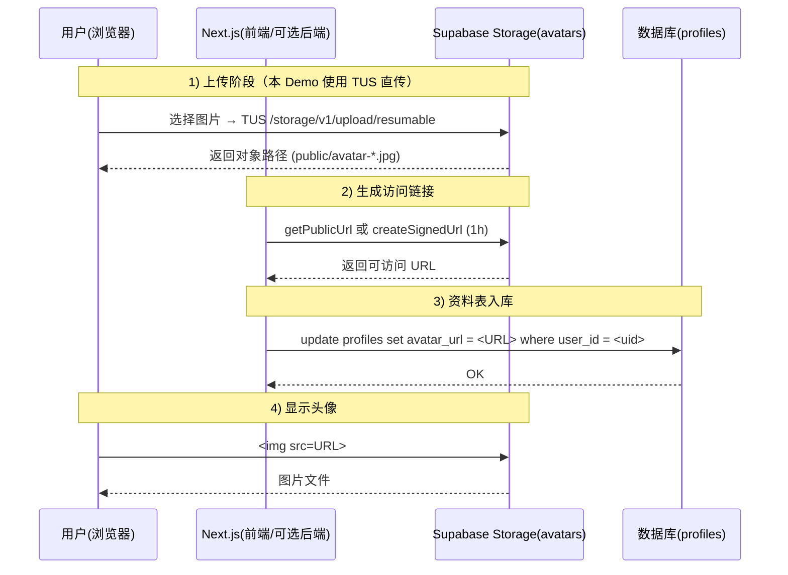

# Project Burger Shop Storage Uploads - Resumable File Uploads with TUS Protocol

This project demonstrates **resumable file uploads** using Supabase Storage with the TUS protocol, featuring a modern drag-and-drop interface powered by Uppy.

**App path:** `apps/project-burger-shop-storage-uploads-4`

## 🚀 Features

### Resumable Upload System
- **🔄 TUS Protocol Support** - Resumable uploads that can continue after interruption
- **📤 Uppy Integration** - Modern drag-and-drop upload interface
- **⚡ Progress Tracking** - Real-time upload progress with visual feedback
- **🎯 Error Handling** - Robust error handling and retry mechanisms
- **📱 Responsive Design** - Works seamlessly on desktop and mobile

### File Management
- **Avatar Upload System** - Upload user profile images to Supabase Storage
- **File Validation** - Size limits (2MB) and type restrictions (PNG, JPG, GIF, WEBP)
- **Accessible Links** - Uses Public URL when bucket is public, otherwise auto‑generates Signed URL (TTL 1h)
- **Policy-Compatible Path** - Default path is `public/avatar-<timestamp>-<uuid>.jpg` to align with common anon RLS

### Technical Features
- **Dynamic Supabase Configuration** - Configure Supabase settings via UI
- **Guest Upload Support** - Anonymous users can upload files
- **Modern UI Components** - Built with React and Tailwind CSS
- **TypeScript Support** - Full type safety throughout the application

## 🛠️ Quick Start

### Prerequisites
- Node.js 18+
- A Supabase project
- Basic knowledge of React and Next.js

### 1. Installation

```bash
cd apps/project-burger-shop-storage-uploads-4
npm install
```

### 2. Environment Setup

Create `.env.local` file (optional - you can also configure via UI):

```bash
# Supabase Configuration
NEXT_PUBLIC_SUPABASE_URL=https://your-project-ref.supabase.co
NEXT_PUBLIC_SUPABASE_ANON_KEY=your-anon-key
# Optional: enable server-side signing fallback for private buckets
# (server-only, never expose to the browser)
SUPABASE_SERVICE_ROLE_KEY=your-service-role-key
```

### 3. Supabase Storage Setup

**⚠️ IMPORTANT:** You must create the `avatars` storage bucket before uploads will work.

#### Option A: Via Supabase Dashboard (Recommended)

1. Go to [Supabase Dashboard](https://supabase.com/dashboard)
2. Select your project → Storage → Create bucket
3. Create bucket with these settings:
   ```
   Name: avatars
   Public bucket: ✅ (checked)
   File size limit: 2 MB
   Allowed MIME types: image/jpeg, image/png, image/gif, image/webp
   ```

#### Option B: Using Setup Script

```bash
# Configure your .env.local first, then run:
node scripts/setup-storage.js
```

### 4. Start Development Server

```bash
npm run dev
```

Visit `http://localhost:3000/profile` to test the upload functionality.

## 📖 Detailed Setup Guide

For complete setup instructions, see [STORAGE_SETUP.md](./STORAGE_SETUP.md)

## 🎯 How It Works

### TUS Protocol Integration

This project uses the **TUS (Transloadit Upload Server)** protocol for resumable uploads:

1. **File Selection** - User selects files via drag-and-drop or file picker
2. **Upload Initialization** - TUS creates an upload session with Supabase Storage
3. **Chunked Upload** - File is uploaded in chunks, allowing for interruption and resumption
4. **Progress Tracking** - Real-time progress updates via Uppy's dashboard
5. **Completion** - File is finalized and made available in Supabase Storage

### Component Architecture

```
UppyUpload Component
├── Uppy Core - File handling and upload management
├── Dashboard Plugin - Drag-and-drop UI interface
├── TUS Plugin - Resumable upload protocol
└── Supabase Integration - Storage backend connection
```

### File Organization

Default (policy‑compatible demo):
```
avatars/
└── public/
    └── avatar-<timestamp>-<uuid>.jpg
```

Alternative (if you adjust RLS to folder‑scope):
```
avatars/
├── <auth_uid>/          # Authenticated user uploads
│   └── avatar-<timestamp>-<uuid>.<ext>
└── guest/               # Anonymous uploads
    └── <uuid>-avatar-<timestamp>.<ext>
```

## 🔧 Configuration Options

### Upload Restrictions

- **File Size**: Maximum 2MB per file
- **File Types**: PNG, JPG, GIF, WEBP only
- **Concurrent Uploads**: Up to 3 files simultaneously
- **Retry Logic**: Automatic retry on network failures

### Supabase Storage Settings

The application supports both:
- **Environment Variables** - Set in `.env.local`
- **Dynamic Configuration** - Configure via UI settings panel

## 🪣 Storage 名称与路径配置（-4 专用）

本 Demo 默认使用：
- Bucket 名：`avatars`
- 文件夹前缀：`public/`
- 对象命名：`public/avatar-<timestamp>-<uuid>.jpg`

你可以改成自己的命名，但需要同时改三处并对齐 RLS：

1) 在 Supabase Dashboard 创建（或改名）Bucket
- Dashboard → Storage → Create bucket → 设定你的 Bucket 名（例如 `my-avatars`）。
- 决定是否 Public（公开）或 Private（私有）。本 Demo 支持两者，私有桶会自动使用 Signed URL。

2) 在本项目代码中替换 Bucket 名/前缀
- 搜索并替换 `avatars` 为你的 Bucket 名；搜索并替换 `public/` 为你的前缀（若需要）。常见位置：
  - `apps/project-burger-shop-storage-uploads-4/app/components/UppyUpload.tsx`
    - `file.meta = { bucketName: 'avatars', objectName: 'public/...' }`
    - `supabase.storage.from('avatars').getPublicUrl(objectName)`
    - `supabase.storage.from('avatars').createSignedUrl(objectName, ...)`
  - `apps/project-burger-shop-storage-uploads-4/app/api/storage/sign/route.ts`
    - `createSignedUrl` 里的 `.from('avatars')`
  - 可选：若你改了前缀，不是 `public/`，调试区会提示 `expect: public`；这是文案，不影响功能。

3) 对齐 Storage RLS 策略（签名/列表需要 SELECT；上传需要 INSERT/UPDATE）
- 仅匿名 + `public/*.jpg`（最小策略）：
  ```sql
  -- 用于 createSignedUrl / list 的只读策略
  create policy "avatars select for signing"
  on storage.objects
  for select to public
  using (
    bucket_id = 'avatars' and split_part(name,'/',1) = 'public' and lower(storage.extension(name)) = 'jpg'
  );

  -- 允许匿名写入 public 前缀（TUS 续传需要 update）
  create policy "avatars anon insert"
  on storage.objects for insert to anon
  with check (bucket_id='avatars' and split_part(name,'/',1)='public');

  create policy "avatars anon update"
  on storage.objects for update to anon
  using (bucket_id='avatars' and split_part(name,'/',1)='public')
  with check (bucket_id='avatars' and split_part(name,'/',1)='public');
  ```
- 如改了 Bucket 名或前缀，请把上面的 `'avatars'`、`'public'` 替换成你的值；如需兼容 `.jpeg` 也可把 `= 'jpg'` 改为 `in ('jpg','jpeg')`。

4) 验证配置
- 打开 `/profile` 上传图片，Links 下方的 Debug 面板会显示：
  - `objectName`、HTTP `HEAD` 状态、`list()` 可见性、client/server 签名请求参数与结果。
- 若看到 `client createSignedUrl -> success`，说明客户端签名已通过。
- 若客户端被 RLS 拦截，也会自动尝试调用 `/api/storage/sign`（配置了 `SUPABASE_SERVICE_ROLE_KEY` 时）。

小贴士
- 只想“每次覆盖同一路径”而不是生成新文件名？把 `objectName` 固定为比如 `public/avatar-current.jpg`，并改用经典 `upload()` API 且设置 `upsert: true`，或者在上传前删除旧对象。
- 使用 Debug 面板排错：若 `list('public', search='<文件名>') -> 0 item(s)`，说明当前角色对该对象无 SELECT 权限，需要放宽 `for select` 策略。

## 👤 头像上传与保存（Supabase 方案）

下面给出“把头像上传到 Storage，并把地址保存到用户资料表”的两种常用实现：纯前端直传（最简单）与服务端辅助（更稳）。

### 流程图（Mermaid）



### A. 纯前端直传（-4 已内置）

- 上传：Uppy+TUS 直传到 `avatars/public/*.jpg`（参见 `UppyUpload.tsx`）。
- 生成链接：先 HEAD 验证 public URL，失败则 `createSignedUrl(path, 3600)`，再失败则可选“服务端兜底签名”。
- 写入资料：

```ts
// 已登录用户：把链接写入 profiles.avatar_url（-4 使用 user_id 主键）
const { error } = await supabase
  .from('profiles')
  .update({ avatar_url: url })
  .eq('user_id', user.id);

// 成功后（可选）通知头部头像组件刷新
window.dispatchEvent(new CustomEvent('avatar:updated', { detail: { url } }));
```

### B. 服务端辅助（可选，更稳）

- 目的：当客户端因 RLS 无法 `createSignedUrl` 或需要服务端把链接落库时，走服务器接口。
- 本 Demo 已提供“服务器兜底签名”接口：`POST /api/storage/sign { path, expiresIn }`（需 `.env.local` 配置 `SUPABASE_SERVICE_ROLE_KEY`）。
- 你也可以新增一个“保存头像”接口，例如：

```ts
// apps/project-burger-shop-storage-uploads-4/app/api/profile/avatar/route.ts
import { NextResponse } from 'next/server';
import { createClient } from '@supabase/supabase-js';

export async function POST(req: Request) {
  const { url } = await req.json(); // 已经上传并拿到的 URL
  const supabase = createClient(process.env.NEXT_PUBLIC_SUPABASE_URL!, process.env.SUPABASE_SERVICE_ROLE_KEY!);
  // 从前端携带的用户 JWT 中解析 uid（生产中用 middleware/headers 验证）
  // 这里简化：假设传 user_id
  const { user_id } = await req.json();
  const { error } = await supabase.from('profiles').upsert({ user_id, avatar_url: url }).select('user_id').single();
  if (error) return NextResponse.json({ error: error.message }, { status: 400 });
  return NextResponse.json({ ok: true });
}
```

前端在上传成功后：

```ts
await fetch('/api/profile/avatar', {
  method: 'POST',
  headers: { 'Content-Type': 'application/json' },
  body: JSON.stringify({ user_id: user.id, url })
});
```

### C. 最小资料表（可选）

如果你需要把头像“记住”在用户资料里，准备一个最小 `profiles` 表即可：

```sql
create table if not exists public.profiles (
  user_id uuid primary key references auth.users(id) on delete cascade,
  avatar_url text
);
alter table public.profiles enable row level security;
create policy "profiles self select" on public.profiles for select to authenticated using (auth.uid() = user_id);
create policy "profiles self update" on public.profiles for update to authenticated using (auth.uid() = user_id) with check (auth.uid() = user_id);
```

这样在登录态下，前端即可 `update profiles set avatar_url=... where user_id=auth.uid()`。

### D. 小贴士

- 私有桶：public URL 会 404，使用 `createSignedUrl` 或服务器兜底签名；-4 已自动优先返回可用链接。
- RLS：签名/列表需要 `storage.objects` 的 `SELECT`。若 `createSignedUrl` 返回“Object not found”，多半是被 RLS 伪装。可添加仅用于签名的只读策略（见上一节）。
- 断点续传缓存：本 Demo 默认关闭（详见“Troubleshooting → TUS Resume Cache”）。

## 🚀 Usage Guide

### Basic Upload Flow

1. **Navigate** to `/profile` page
2. **Configure Supabase** (if not set via environment variables)
3. **Drag files** into the upload area or click to select
4. **Monitor progress** in the upload dashboard
5. **View results** - Uploaded files appear in your profile

### For Developers

```typescript
// Import the component
import UppyUpload from '@/components/UppyUpload';

// Use in your React component
<UppyUpload
  supabase={supabaseClient}
  user={currentUser}
  onUploadSuccess={(url) => console.log('Uploaded:', url)}
  onUploadError={(error) => console.error('Error:', error)}
/>
```

## 🛠️ Development

### Local Development

```bash
npm run dev
```

The application will be available at `http://localhost:3000`

### Project Structure

```
app/
├── components/
│   └── UppyUpload.tsx      # Main upload component
├── profile/
│   └── page.tsx            # Profile page with upload
└── lib/
    └── supabase/           # Supabase client configuration
scripts/
└── setup-storage.js        # Automated bucket setup
```

## 🔍 Troubleshooting

### Common Issues

**"Bucket not found" Error**
- Ensure the `avatars` bucket exists in your Supabase project
- Follow the setup guide in [STORAGE_SETUP.md](./STORAGE_SETUP.md)

**403 new row violates row-level security policy**
- Your Storage RLS policies don’t allow the current path/role. This demo defaults to `avatars/public/*.jpg` for anon compatibility. Either:
  - Keep current path and add INSERT/UPDATE policies for `public/` prefix; or
  - Change the path pattern and update policies accordingly (see File Organization above).

**Upload Fails Immediately**
- Check your Supabase URL and API key configuration
- Verify the bucket is set to public
- Ensure file size is under 2MB

**CSS Styles Not Loading**
- Uppy styles are imported automatically
- If issues persist, check the CSS import paths in `UppyUpload.tsx`

### TUS Resume Cache (Important)

TUS enables resumable uploads by caching a fingerprint for each local file. When you re‑select the same local file (same name/size/mtime), the client may “resume” an already finished upload and instantly mark it complete without creating a new object. This can look like “I uploaded again, but the remote didn’t change”.

What we do in this demo
- Disabled resumable cache and removed fingerprints after success so every selection triggers a fresh upload.
- Code (in `UppyUpload.tsx`):

```ts
uppy.use(Tus, {
  endpoint,
  headers: { authorization: `Bearer ${supabaseKey}`, apikey: supabaseKey },
  resume: false,                 // do not reuse old upload sessions
  removeFingerprintOnSuccess: true, // clean any residual fingerprints
  uploadDataDuringCreation: true,
  chunkSize: 6 * 1024 * 1024,
  allowedMetaFields: ['bucketName','objectName','contentType','cacheControl']
})
```

Alternatives
- If you want “overwrite same path” behavior instead of creating new filenames, fix `objectName` (e.g., `public/avatar-current.jpg`) and enable upsert on classic upload API, or handle overwrite with a server action.
- If you want resumable behavior back, set `resume: true` (default) but be aware of the caching side‑effects above.

### 注意事项：小心断点续传的设定

- 如果开启断点续传（`resume: true`，默认值），当你再次选择“同一个本地文件”（名称/大小/修改时间一致），客户端可能命中旧的上传会话并判定“已完成”，不会真正发起新上传，看起来像“远端没变化”。
- 本 Demo 为避免该坑，默认关闭断点续传并在成功后清除指纹（`resume: false` + `removeFingerprintOnSuccess: true`）。
- 如果业务上必须开启断点续传，请务必：
  - 确保每次生成唯一文件名（避免复用同一路径），或
  - 定期清理本地 tus 指纹缓存，或
  - 需要覆盖固定路径时，优先在上传前删除旧对象，再发起上传；或改用非 TUS 的 `upload()` API 并设置 `upsert: true`（仅适用于经典上传端点）。

### Debug Mode

Enable debug logging by setting:
```typescript
// In UppyUpload.tsx
uppy.setOptions({ debug: true });
```

## 📚 Additional Resources

- [Supabase Storage Documentation](https://supabase.com/docs/guides/storage)
- [TUS Protocol Specification](https://tus.io/protocols/resumable-upload.html)
- [Uppy Documentation](https://uppy.io/docs/)
- [Complete Setup Guide](./STORAGE_SETUP.md)

## 🔒 Public URL vs Signed URL

This demo now shows BOTH links after upload:
- Public URL (if the bucket is truly public; verified via HTTP HEAD)
- Signed URL (1h) fallback for private buckets
It never shows only a fake public URL for a private bucket.

Code pattern used:

```ts
// Prefer a real public URL (verify with HEAD)
const { data: pub } = supabase.storage.from('avatars').getPublicUrl(path);
const publicUrl = pub.publicUrl;
let finalUrl: string | undefined;
if (publicUrl) {
  const head = await fetch(publicUrl, { method: 'HEAD' });
  if (head.ok) finalUrl = publicUrl; // bucket is truly public
}

// If not public (or HEAD failed), try a Signed URL (1 hour)
if (!finalUrl) {
  const { data: signed } = await supabase.storage
    .from('avatars')
    .createSignedUrl(path, 60 * 60);
  finalUrl = signed?.signedUrl;
}

// If still no URL, your current role likely lacks select permission to sign
```

Notes:
- Public URL: never expires; best for truly public assets.
- Signed URL: includes a signature and TTL; ideal for private buckets. Generating it from the browser requires `storage.objects` select permission for the current role.
  - Note: right after a resumable upload finalizes, there can be a short propagation delay. The app retries signed-URL creation a few times with a small backoff.

Edge cases
- If the bucket is private and the current role lacks `select` on `storage.objects`, the app will still mark the upload as successful and show the constructed Public URL (flagged as blocked) but cannot generate a Signed URL. In that case, either:
  - Make the bucket public and add a read policy; or
  - Keep it private and add a minimal `select` policy just for signing; or
  - Generate the signed URL on your server/Edge Function with a service role and return it to the client.

## 🤝 Contributing

1. Fork the repository
2. Create a feature branch
3. Make your changes
4. Test the upload functionality
5. Submit a pull request

## 📄 License

This project is part of the Supabase demos collection and is available under the MIT License.

#### LLM Chat
```
POST /functions/v1/llm-chat
```

#### Send Email
```
POST /functions/v1/send-email
```

#### User Registration
```
POST /functions/v1/user-registration
```

#### Sign Up with Invite
```
POST /functions/v1/signup-with-invite
```

#### Manage Invites
```
GET    /functions/v1/manage-invites
POST   /functions/v1/manage-invites
PUT    /functions/v1/manage-invites?id=xxx
DELETE /functions/v1/manage-invites?id=xxx
```

#### Weather Service
```
GET /functions/v1/weather?lat=37.7749&lon=-122.4194
```

## 🗄️ Database Schema

### Core Tables

#### `invite_codes`
- Invitation code management
- Usage tracking and expiration
- Creator attribution

#### `profiles`
- Extended user profiles
- Avatar URL storage
- Social features support

#### `audit_logs`
- Action tracking and compliance
- User activity logging
- Change history

#### `email_queue`
- Asynchronous email processing
- Template management
- Delivery status tracking

### Storage Tables

#### `storage.objects` (Supabase built-in)
- File metadata and paths
- Bucket organization
- Access control through policies

## 🔧 Configuration

### Storage Policies

The storage policies are automatically created by the init script:

```sql
-- Public read access for avatars
CREATE POLICY "avatars read all" ON storage.objects
  FOR SELECT USING (bucket_id = 'avatars');

-- Authenticated users can only access their own folder
CREATE POLICY "avatars write self" ON storage.objects
  FOR ALL USING (
    bucket_id = 'avatars' AND
    split_part(name, '/', 1) = auth.uid()::text
  );

-- Anonymous users can upload to guest folder
CREATE POLICY "avatars anon upload guest" ON storage.objects
  FOR INSERT WITH CHECK (
    bucket_id = 'avatars' AND
    auth.role() = 'anon' AND
    split_part(name, '/', 1) = 'guest'
  );
```

### Custom Email Templates

Add new templates in the `send-email` Edge Function:

```typescript
const templates = {
  'custom-template': (data) => ({
    subject: 'Custom Subject',
    html: '<p>Custom HTML content</p>',
    text: 'Custom text content'
  })
}
```

## 🧪 Testing

### Storage Testing

```bash
# Test avatar upload (via UI or API)
curl -X POST http://localhost:3000/api/upload \
  -H "Authorization: Bearer YOUR_JWT_TOKEN" \
  -F "file=@/path/to/avatar.jpg"
```

### Edge Function Testing

```bash
# Test LLM chat
curl -X POST http://localhost:54321/functions/v1/llm-chat \
  -H "Content-Type: application/json" \
  -d '{"messages":[{"role":"user","content":"Hello"}]}'

# Test email sending
curl -X POST http://localhost:54321/functions/v1/send-email \
  -H "Content-Type: application/json" \
  -d '{"to":"test@example.com","templateName":"welcome"}'
```

## 🔒 Security Features

### Storage Security
- **Row Level Security** on storage objects
- **Path-based Access Control** - users can only access their own folders
- **File Type Validation** - restricted to image formats
- **Size Limits** - configurable upload size limits
- **Anonymous Upload Controls** - isolated guest folder

### Data Security
- **RLS Policies** on all database tables
- **JWT Authentication** for all operations
- **Input Validation** and sanitization
- **Audit Logging** for compliance
- **Rate Limiting** capabilities

## 📊 Monitoring & Maintenance

### Database Functions

```sql
-- Check Edge Function status
SELECT * FROM get_edge_function_status();

-- Cleanup old audit logs (keep 90 days)
SELECT cleanup_old_audit_logs();

-- Cleanup processed emails (keep 7 days)
SELECT cleanup_processed_emails();
```

### Monitoring

Monitor via:
- **Supabase Dashboard** - Storage usage and function logs
- **Database Tables** - audit_logs and email_queue status
- **Edge Function Metrics** - Request/response logs
- **Storage Analytics** - File upload/download statistics

## 🚀 Production Deployment

### 1. **Storage Setup**
   - Create storage bucket via Dashboard or SQL
   - Configure appropriate file size limits
   - Set up CDN if needed for global distribution

### 2. **Security Configuration**
   - Review and tighten RLS policies
   - Configure signed URLs for private content
   - Set up proper CORS policies

### 3. **Edge Functions Deployment**
   - Deploy all functions with proper secrets
   - Configure monitoring and alerting
   - Set up error tracking

### 4. **Maintenance Tasks**
   - Schedule regular cleanup of old logs
   - Monitor storage usage and costs
   - Update email templates as needed

## 🎯 Use Cases

This demo demonstrates real-world applications:

- **Social Media Platforms** - User avatars and profiles
- **SaaS Applications** - User management with invites
- **Content Management** - File uploads with access control
- **Customer Support** - LLM-powered chat systems
- **Marketing Automation** - Email campaigns and user onboarding

## 📚 Further Reading

- [Supabase Storage Documentation](https://supabase.com/docs/guides/storage)
- [Supabase Edge Functions](https://supabase.com/docs/guides/functions)
- [Row Level Security Guide](https://supabase.com/docs/guides/auth/row-level-security)
- [OpenAI API Documentation](https://platform.openai.com/docs)

---

**🎉 Advanced Storage & Edge Functions Demo - showcasing production-ready Supabase capabilities!**
